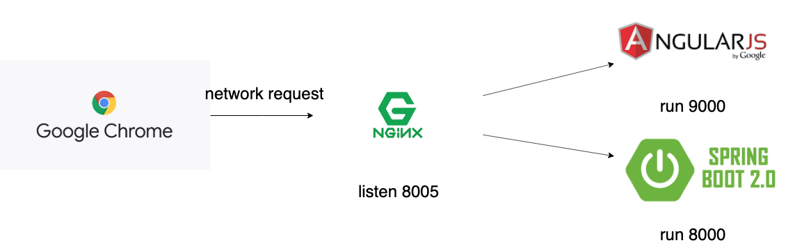

# 物流运输平台

声明：本系统不再维护，部分框架与组件已过时，仅供《河北工业大学》学生学习交流使用。

## 河北工业大学 软件设计与编程实践

勤慎公忠

`2016`级软件工程学生作品

完成人：张喜硕 曽斯维 刘超 刘振飞


## 软件架构



## 开发环境

版本控制工具：[Git](https://git-scm.com/)

反向代理服务器：[NGINX](http://nginx.org/en/download.html)

前端浏览器：[Chrome](https://www.google.cn/intl/zh-CN/chrome/)

世界上最大的前端生态：[Node.js](http://nodejs.cn/download/)

最好的`Java`开发工具：[IDEA](https://www.jetbrains.com/idea/)

最好的轻量级文本编辑器：[Sublime](http://www.sublimetext.com/)

`Java`项目管理工具：[Maven](https://maven.apache.org/)

## 快速启动

**克隆此项目**

```shell
git clone https://github.com/TomorrowFramework/logistics.git
```

**进入前端项目目录**

```
cd webApp
```

**安装`npm`依赖**

```
npm install
```

**安装`bower`依赖**

```
bower install
```

注：安装需要网络环境支持，`npm`加速可选用[淘宝镜像](https://npm.taobao.org/)，`bower`加速请配置网络代理，推荐`V2Ray`。

```
grunt live
```

执行命令后，浏览器自动弹出`http://localhost:9000/#!/login`页面即证明前端启动成功。


### 后台启动

```
cd api
mvn spring-boot:run
```
