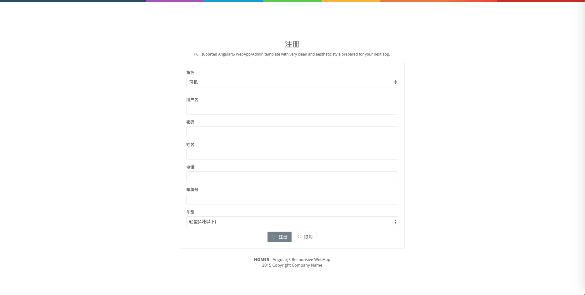
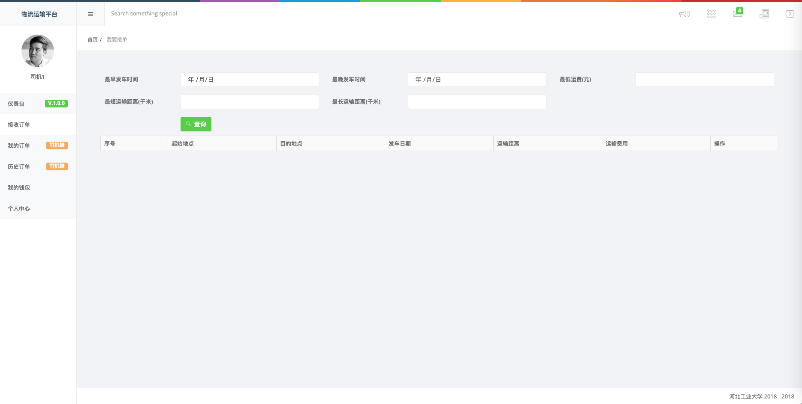
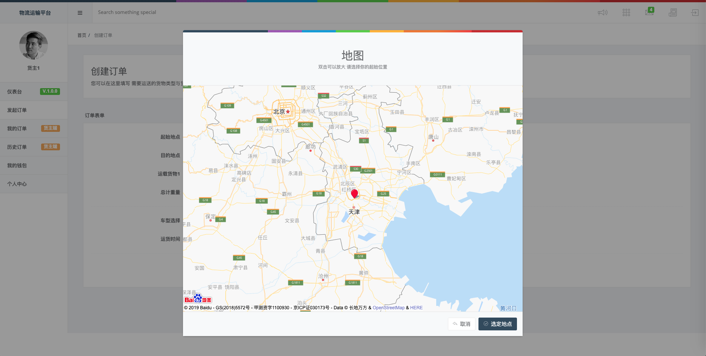
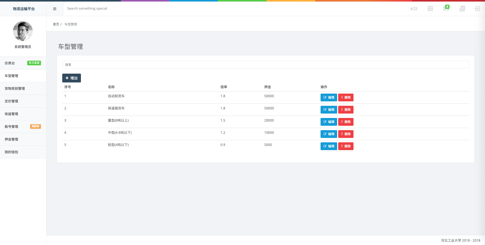
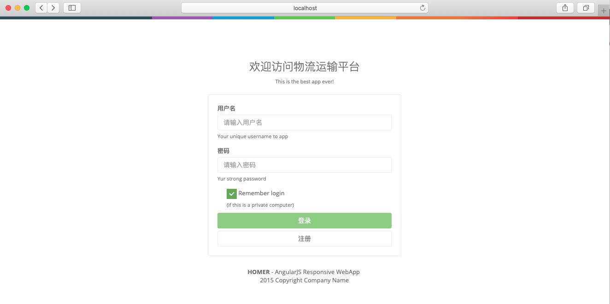
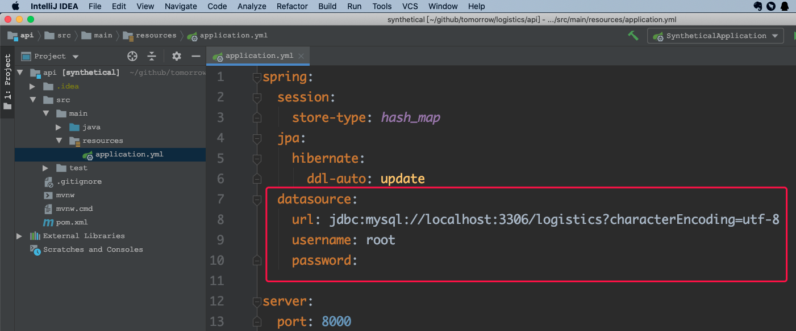
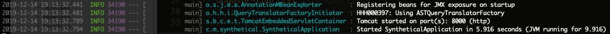
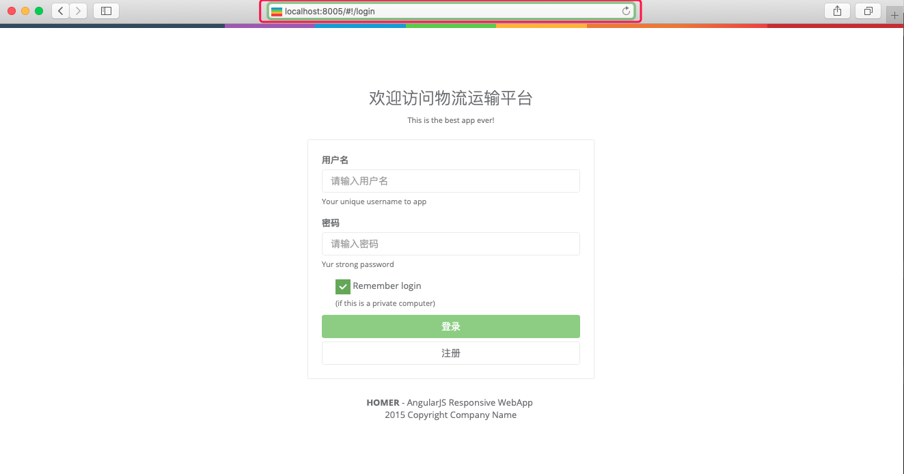

# 物流运输平台

> 声明：本系统不再维护，部分框架与组件已过时，仅供《河北工业大学》学生学习交流使用。

## 河北工业大学 勤慎公忠

> 软件设计与编程实践，软件工程`2016`级学生作品。

***完成人：张喜硕 曽斯维 刘超 刘振飞***


## 主要功能

### 通用功能

登录、注册、注销



### 司机端

接收订单、我的订单、历史订单、我的钱包、交易记录、押金缴纳、个人中心



### 货主端

发起订单、我的订单、历史订单、我的钱包、交易记录、个人中心



### 管理端

车型管理、货物类别管理、定价管理、收益管理、账号管理、押金管理、我的钱包



## 软件架构


## 开发环境[推荐 `Unix`]

> 版本控制工具：[Git](https://git-scm.com/)

> 反向代理服务器：[NGINX](http://nginx.org/en/download.html)

> 前端浏览器：[Chrome](https://www.google.cn/intl/zh-CN/chrome/)

> 世界上最大的前端生态：[Node.js](http://nodejs.cn/download/)

> 最好的`Java`开发工具：[IDEA](https://www.jetbrains.com/idea/)

> 最好的轻量级文本编辑器：[Sublime](http://www.sublimetext.com/)

> `Java`项目管理工具：[Maven](https://maven.apache.org/)

> 开源关系型数据库：[MySQL](https://www.mysql.com/)[推荐 `Docker` + `Kitematic`]

## 快速启动

- 克隆此项目

```shell
git clone https://github.com/TomorrowFramework/logistics.git
```

- 进入前端项目目录

```
cd webApp
```

- 安装`npm`依赖

```
npm install
```

- 安装`bower`依赖

```
bower install
```

> 注：安装需要网络环境支持，`npm`加速可选用[淘宝镜像](https://npm.taobao.org/)，`bower`加速请配置网络代理，推荐`V2Ray`。

- 前端启动

```
grunt live
```

> 执行命令后，浏览器自动弹出`http://localhost:9000/#!/login`页面即证明前端启动成功。



- 配置数据库

定位到`api/src/main/resources`目录，修改程序配置`application.yml`。



- 进入后台项目目录

```
cd api
```

- 后台启动

```
mvn spring-boot:run
```

> 执行出现类似如下日志信息表示后台启动成功。



- 配置`NGINX`

定位到`NGINX`配置目录，引入当前项目下的`NGINX`配置文件。


- 重新加载`NGINX`配置

```
nginx -s reload
```

浏览器访问：`http://localhost:8005/#!/login`，成功显示即配置成功。


